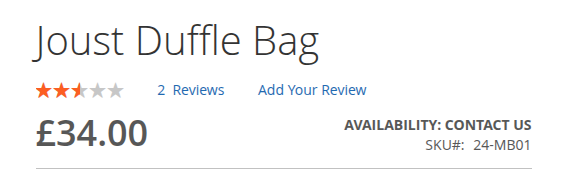
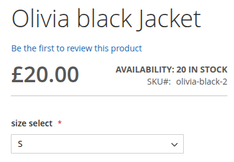
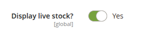
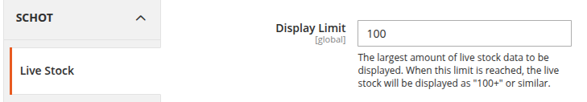

# LiveStock

This is a module that was made for a customer to show the stock on certain products. If the stock falls below a 1 it will show "Contact Us" and if above a configurable limit, it will say limit+, for instance if the limit is set to 100 and there are 101 in stock it will say 100+.

This stock block replaces the default "In Stock/Out of Stock" block.

## Product types
This customer only used simples and configurables with select dropdowns (no swatches) so this module is limited to those product types.

## Product Set up
For each product that you want to show the stock on you should enable "Display live stock"

## Configuration
To set the limit go to Stores >> Configuration >> Schot >> LiveStock

